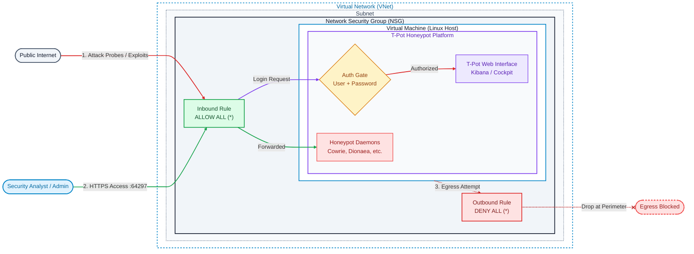

# Azure Honeypot — T-Pot Threat Intelligence Lab

## Overview

This project deploys a [T-Pot](https://github.com/telekom-security/tpotce) multi-honeypot platform on a dedicated Azure Virtual Machine to observe real-world attacker behavior against internet-facing systems. The VM is intentionally exposed to the internet on all ports to attract traffic, while network-level controls isolate it from any other resources so that a compromise cannot pivot laterally or escalate beyond the honeypot itself.

**Goal:** Collect live attack telemetry (scan patterns, exploit attempts, credential stuffing, malware drops, etc.) in a safe, contained environment, and use that data to build detection and analysis skills.

## Architecture

- **VNet / Subnet:** A dedicated virtual network and subnet, used exclusively for this honeypot — not peered or connected to any other network, home lab, or production resources.
- **NSG (Network Security Group):** Configured to isolate the honeypot at the network layer:
  - No outbound rules permitting traffic into other subnets, VNets, or peered networks (prevents horizontal/lateral movement).
  - No rules allowing the honeypot to reach management or admin planes (prevents vertical/privilege escalation paths).
  - Inbound traffic from the internet is allowed broadly (by design, to attract attackers), while management access (SSH) is the only channel used by the operator.
- **VM:** Runs T-Pot, which fronts a suite of honeypot daemons (e.g., Cowrie, Dionaea, Suricata, and others bundled with T-Pot) behind its own internal Docker network, plus an ELK-based dashboard (Kibana) for visualizing captured activity.

## Isolation & Safety Design

The core design principle: **assume the honeypot VM will be compromised, and make sure that doesn't matter.**

- The VNet/subnet exists solely for this VM — no shared resources, no routes to other environments.
- NSG rules are scoped to prevent the honeypot from initiating connections outward to anything other than what's required for its own operation (e.g., OS/T-Pot updates), blocking any attempt to use it as a pivot point.
- SSH access is retained only for administration and is treated as a sensitive, monitored channel.
- No credentials, keys, or data of value are stored on the VM beyond what T-Pot itself requires.

## Data Collection

Data collection began as soon as the VM was deployed and exposed. T-Pot captures:

- Connection attempts and port scans across exposed services
- Interaction logs from individual honeypot daemons (login attempts, commands run, files dropped)
- Network-layer intrusion detection alerts (Suricata)
- Aggregated views and dashboards via T-Pot's built-in Kibana interface

## Objectives / What This Demonstrates

- Practical Azure networking: VNets, subnets, and NSGs used for security segmentation, not just connectivity
- Understanding of lateral movement and privilege escalation risks, and how to design against them at the network layer
- Hands-on experience deploying and operating a honeypot platform (T-Pot)
- Analysis of real-world attacker behavior using captured telemetry

## Findings / Observations

This project was recently deployed, so data collection is still early. A preliminary snapshot so far:

**Top source countries (by attacker IP volume):**
1. United States
2. Pakistan
3. Netherlands

**Most-targeted port:** Telnet

A full analysis (common exploit signatures, notable payloads, credential patterns) is planned once more data has accumulated.

## What I Learned

As a student building this as a hands-on learning project, the deployment itself covered several core Azure networking and security concepts:

- **VNets and subnets:** What a Virtual Network is, and how to create one along with a subnet inside it.
- **NSGs:** What a Network Security Group is for, and how to attach one to a subnet so it acts as a security filter controlling inbound and outbound traffic.
- **VM deployment:** How to deploy a virtual machine and attach it to the correct network and subnet to maximize isolation and security.

Next up is learning to analyze the captured T-Pot data itself — identifying attack patterns, correlating source IPs, and pulling out meaningful trends from the noise.

## Future Improvements

- Forward T-Pot data into Microsoft Sentinel for centralized detection/alerting
- Add automated alerting on specific attack patterns
- Compare attacker behavior across multiple honeypot flavors/regions

## Disclaimer

This honeypot is deployed in an isolated environment for educational purposes only. It is not connected to any production systems.
